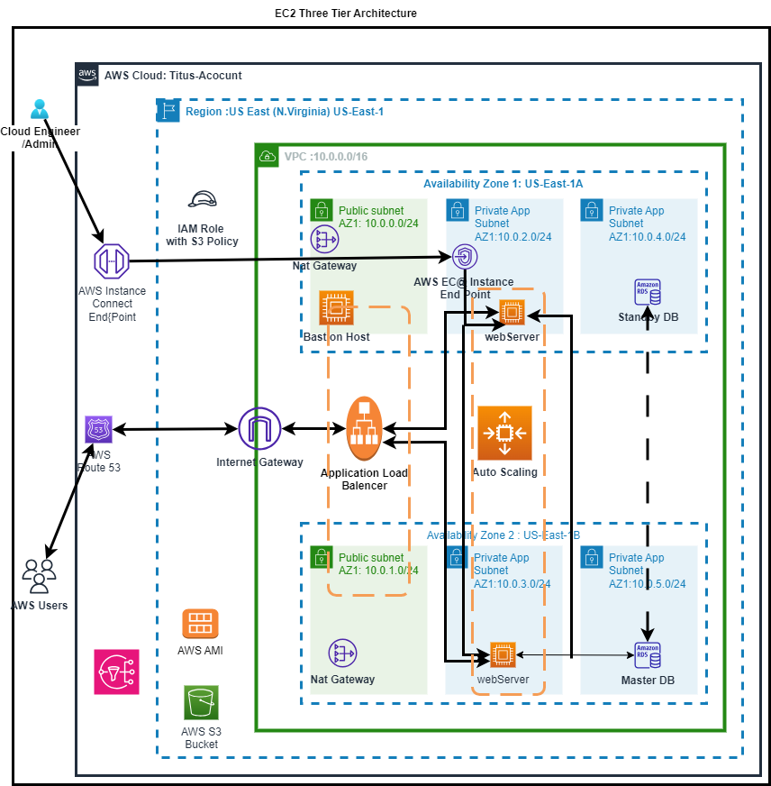

## Hosting a Dynamic E-commerce Web App on AWS

### Overview

This DevOps project showcases the deployment of a dynamic e-commerce web app on AWS, utilizing various AWS services and resources to ensure scalability, high availability, fault tolerance, and security.

### Architecture



### AWS Resources Utilized

1. **Virtual Private Cloud (VPC):**
   - Established a VPC with public and private subnets spanning two availability zones.

2. **Internet Gateway:**
   - Utilized an Internet Gateway to enable communication between instances in the VPC and the internet.

3. **Availability Zones:**
   - Utilized two availability zones for enhanced availability and fault tolerance.

4. **Public Subnet Resources:**
   - Placed Nat Gateway, Bastion Host, and Application Load Balancer in public subnets.

5. **EC2 Instance Connect Endpoint:**
   - Leveraged the EC2 Instance Connect endpoint for secure SSH access to resources in both public and private subnets.

6. **Web Server and Database Placement:**
   - Positioned web servers and database servers in private subnets for enhanced security.

7. **Nat Gateway for Internet Access:**
   - Enabled instances in private App and Data subnets to access the internet through Nat Gateway.

8. **MySQL RDS Database:**
   - Utilized MySQL RDS for the database.

9. **Flyway for Database Migration:**
   - Used Flyway for database migration to ensure version control.

10. **EC2 Instances for Website Hosting:**
    - Utilized EC2 instances to host the dynamic e-commerce website.

11. **Application Load Balancer (ALB):**
    - Implemented an ALB to distribute web traffic across an Auto Scaling Group of EC2 instances in multiple availability zones.

12. **Security Groups:**
    - Configured security groups as firewalls to control the flow of traffic.

13. **Auto Scaling Group:**
    - Utilized an Auto Scaling Group to dynamically create EC2 instances, ensuring high availability, scalability, fault tolerance, and elasticity.

14. **Route 53:**
    - Registered a domain name and created a record set using Route 53 for DNS management.

15. **AWS S3 for Web Files:**
    - Used AWS S3 to store web files.

16. **IAM Role for EC2 Instance:**
    - Utilized IAM roles to grant EC2 instances permissions to download web files from S3.

17. **AMI Creation:**
    - Used the EC2 instance to create an Amazon Machine Image (AMI) for future instance launches.

### Deployment Scripts

#### Install Necessary Software

The following script installs the necessary software for the application:

```bash
#!/bin/bash
# This command updates all the packages on the server to their latest versions
sudo yum update -y

# This series of commands installs the Apache web server, enables it to start on boot, and then starts the server immediately
sudo yum install -y httpd
sudo systemctl enable httpd 
sudo systemctl start httpd

## This command installs PHP 8 along with several necessary extensions for the application to run
sudo dnf install -y php php-cli php-fpm php-mysqlnd php-bcmath php-ctype php-fileinfo php-json php-mbstring php-openssl php-pdo php-gd php-tokenizer php-xml

## These commands Installs MySQL version 8
# Install the MySQL Community repository
sudo wget https://dev.mysql.com/get/mysql80-community-release-el9-1.noarch.rpm 
#
# Install the MySQL server
sudo dnf install -y mysql80-community-release-el9-1.noarch.rpm 
dnf repolist enabled | grep "mysql.*-community.*"
sudo dnf install -y mysql-community-server 
#
# Start and enable the MySQL server
sudo systemctl start mysqld
sudo systemctl enable mysqld

# Install the cURL and PHP cURL packages
sudo yum install -y curl libcurl libcurl-devel php-curl --allowerasing

# Restart the PHP-FPM service to apply the changes
sudo service php-fpm restart

# Update the settings, memory_limit to 128M and max_execution_time to 300 in the php.ini file
sudo sed -i 's/^\s*;\?\s*memory_limit =.*/memory_limit = 128M/' /etc/php.ini
sudo sed -i 's/^\s*;\?\s*max_execution_time =.*/max_execution_time = 300/' /etc/php.ini

# This command enables the 'mod_rewrite' module in Apache on an EC2 Linux instance. It allows the use of .htaccess files for URL rewriting and other directives in the '/var/www/html' directory
sudo sed -i '/<Directory "\/var\/www\/html">/,/<\/Directory>/ s/AllowOverride None/AllowOverride All/' /etc/httpd/conf/httpd.conf

```

The following script configures the necessary software for the application:

```bash
#
## Install and configure the application.
#

# This command downloads the contents of the specified S3 bucket to the '/var/www/html' directory on the EC2 instance
sudo aws s3 sync s3://nestapp-bucket /var/www/html
# This command changes the current working directory to '/var/www/html', which is the standard directory for hosting web pages on a Unix-based server
cd /var/www/html

# This command is used to extract the contents of the application code zip file that was previously downloaded from the S3 bucket
sudo unzip nest-app.zip

# This command recursively copies all files, including hidden ones, from the 'nest-app' directory to the '/var/www/html/'.
sudo cp -R nest-app/. /var/www/html/

# This command permanently deletes the 'nest-app' directory and the 'nest-app.zip' file.
sudo rm -rf nest-app nest-app.zip

# This command set permissions 777 for the '/var/www/html' directory and the 'storage/' directory
sudo chmod -R 777 /var/www/html
sudo chmod -R 777 storage/

# This command uses `sed` to search the .env file for a line that starts with APP_NAME= and replaces everything after the "=" character with the app's name.
sudo sed -i "/^APP_NAME=/ s/=.*$/=${PROJECT_NAME}-${ENVIRONMENT}/" .env

# This command uses `sed` to search the .env file for a line that starts with APP_URL= and replaces everything after the "=" character with the app's domain name.
sudo sed -i "/^APP_URL=/ s/=.*$/=https:\/\/${RECORD_NAME}.${DOMAIN_NAME}\//" .env

# This command uses `sed` to search the .env file for a line that starts with DB_HOST= and replaces everything after the "=" character with the RDS endpoint.
sudo sed -i "/^DB_HOST=/ s/=.*$/=${RDS_ENDPOINT}/" .env

# This command uses `sed` to search the .env file for a line that starts with DB_DATABASE= and replaces everything after the "=" character with the RDS database name.
sudo sed -i "/^DB_DATABASE=/ s/=.*$/=${RDS_DB_NAME}/" .env

# This command uses `sed` to search the .env file for a line that starts with DB_USERNAME= and replaces everything after the "=" character with the RDS database username.
sudo sed -i "/^DB_USERNAME=/ s/=.*$/=${USERNAME}/" .env

# This command uses `sed` to search the .env file for a line that starts with DB_PASSWORD= and replaces everything after the "=" character with the RDS database password.
sudo sed -i "/^DB_PASSWORD=/ s/=.*$/=${PASSWORD}/" .env

# This command will replace the AppServiceProvider.php file
sudo aws s3 cp s3://app-service-provider-files/nest-AppServiceProvider.php /var/www/html/app/Providers/AppServiceProvider.php

# This command will restart the Apache server
sudo service httpd restart

#### Migrate SQL Data to Amazon RDS

The following script migrates SQL data to Amazon RDS using Flyway:

```bash
## Migrate sql data to amazon rds

#!/bin/bash

# Download and extract Flyway
sudo wget -qO- https://repo1.maven.org/maven2/org/flywaydb/flyway-commandline/9.20.0/flyway-commandline-9.20.0-linux-x64.tar.gz | tar -xvz

# Create a symbolic link to make Flyway accessible globally
sudo ln -s $(pwd)/flyway-9.20.0/flyway /usr/local/bin

# Create the SQL directory for migrations
sudo mkdir sql

# Download the migration SQL script from AWS S3
aws s3 cp s3://nestapp-bucket1/V1__nest.sql sql/

# Run Flyway migration
sudo flyway -url=jdbc:mysql://"${RDS_ENDPOINT}"/"${RDS_DB_NAME}" \
  -user="${USERNAME}" \
  -password="${PASSWORD}" \
  -locations=filesystem:sql \
  migrate
```

### Instructions for Use

1. **Clone the Repository:**
   - Clone this GitHub repository to your local machine.

2. **Configure AWS Resources:**
   - Use the provided architecture diagram and the AWS Management Console to set up the necessary resources.

3. **Update Scripts:**
   - Modify the scripts to include the correct configurations, such as AWS S3 bucket names, RDS endpoint, credentials, etc.

4. **Run the Scripts:**
   - Execute the scripts on your EC2 instance to deploy and configure the dynamic e-commerce web app.

5. **Access the Website:**
   - Once deployed, access the dynamic e-commerce website using the public DNS or IP address of the load balancer.

